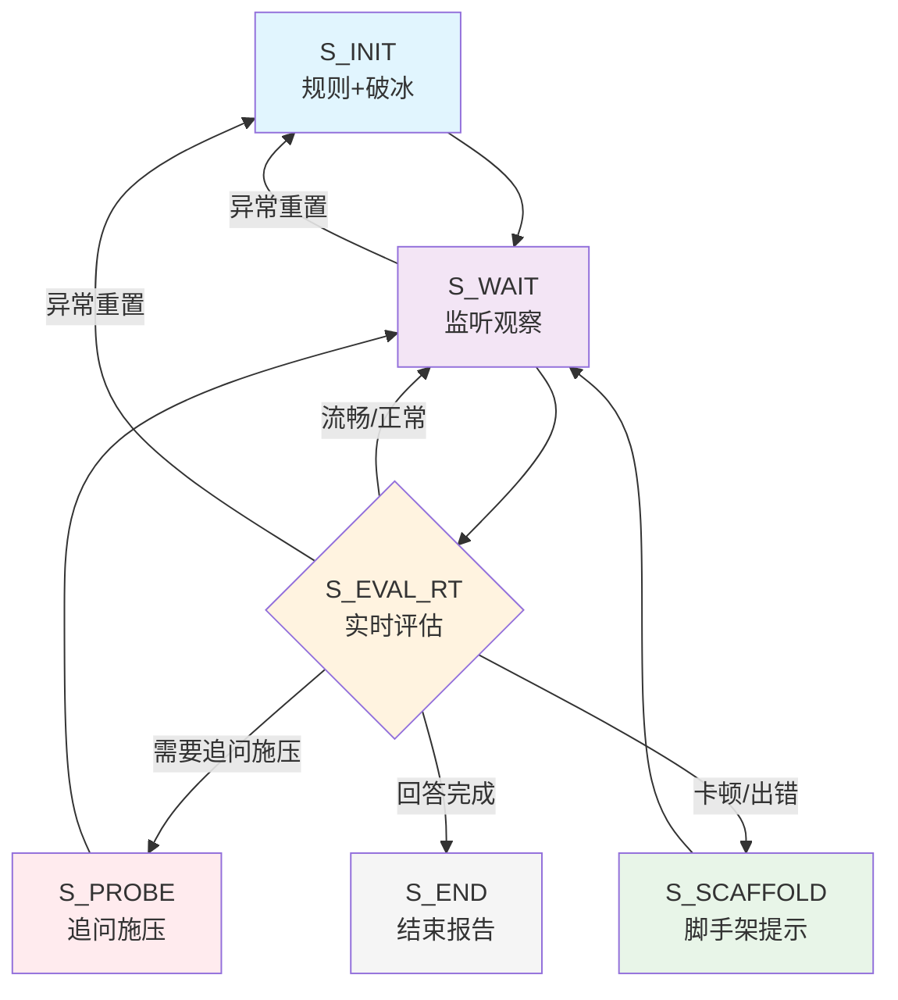

# 状态机

## Q

S_INIT / S_WAIT / S_PROBE / S_SCAFFOLD / S_EVAL_RT / S_END

- **S_INIT**: 
  - 播放欢迎语和规则
  - 从question_bank.json随机选择初始问题
  - 启动ASR监听
  
- **S_WAIT**:
  - 持续监听麦克风
  - 计算沉默时长、语速、犹豫度
  - 如果沉默>阈值，触发S_SCAFFOLD
  
- **S_PROBE**:
  - 根据当前话题生成追问问题
  - 施加认知压力
  
- **S_SCAFFOLD**:
  - L1提示：温和提醒
  - L2提示：具体方向
  - L3提示：直接答案
  
- **S_EVAL_RT**:
  - 调用LLM分析回答质量
  - 检测元认知信号
  - 评估技术深度和逻辑性
  
- **S_END**:
  - 生成能力评估报告
  - 输出雷达图（技术深度、问题解决、沟通表达等维度）

## **Σ**

### 1. **ASR转录文本**（主要输入）

- 学生的语音转录为文本
- 示例：面试官好，我来自南京大学。在技术战上，我具备扎实的C语言功底...
- 格式：实时流式文本 + 时间戳信息

### 2. **语音特征数据**（辅助输入）

- 从音频分析得到的元数据：
  - **沉默/停顿时长**（>0.4s的阈值判断）
  - **语速分析**（317字/分钟）
  - **语音犹豫度**（通过语气词、填充词检测）
  - **音频流状态**（开始/结束/中断标志）

### 3. **时间序列特征**

- ASR输出带时间戳，可以计算：
  - 回答持续时间（67.86秒）
  - 单词间隔时间分布
  - 处理延迟（6.45秒，倍速10.5x）

### 4. **上下文历史**

- 当前对话轮次
- 之前的提问和回答
- 学生已展示的知识点
- 已使用的提示层级（L1-L3）

### 5. **状态机内部信号**

- 当前状态（S_INIT, S_WAIT等）
- 计时器状态（如沉默超时）
- 异常检测标记
- 能力评估中间结果

## **q₀**

**S_INIT**：说明规则，建立基准（Baseline），让学生放松。

​		 调用提问模块，题库名称：question_bank.json

## **F**

 **S_END**：生成能力雷达图

## **δ**

## 输入输出接口规范

openapi.yaml

## **异常处理规则**
1. **ASR失败**:
   - 连续3次转录为空 → 提示检查麦克风
   
2. **LLM超时**:
   - 评估超时 > 5s → 使用基于规则的简单评估
   
3. **学生异常**:
   
   - 说"我不明白" → S_SCAFFOLD L1
   - 说"我搞错了" → 记录为"元认知良好"，允许回溯
   - 长时间沉默 (>10s) → 主动提供帮助选项
   - 要特别注意的跳转逻辑是异常处理： 学生在“实施阶段”突然说：“等一下，我发现我最开始的目标定错了，我要重新定义问题。”
   - 当在S_WAIT或S_EVAL_RT状态检测到异常重置请求时，我们跳转到S_INIT，并设置上下文中的reset_type为：
   
     - "full_reset": 学生明确要求完全重新开始（例如，说“我们重新开始吧”）
     - "partial_reset": 学生只是重新定义当前问题（例如，说“我重新定义一下问题”）
   
     然后，在S_INIT状态中，根据reset_type来决定行为：
   
     - 如果是正常初始化（无reset_type），则进行完整的规则说明和破冰。
     - 如果是partial_reset，则跳过规则说明，直接进入问题重置，并保留部分历史记录（如学生的基本信息，但重置当前问题）。
     - 如果是full_reset，则重置所有上下文，并重新进行规则说明。
   
     同时，我们还需要注意，在异常重置时，我们可能需要对学生的元认知能力进行记录和加分。
   
     所以，我们可以在S_INIT状态中，如果检测到是异常重置，则先对学生的元认知行为进行评价，然后再根据reset_type进行重置。

