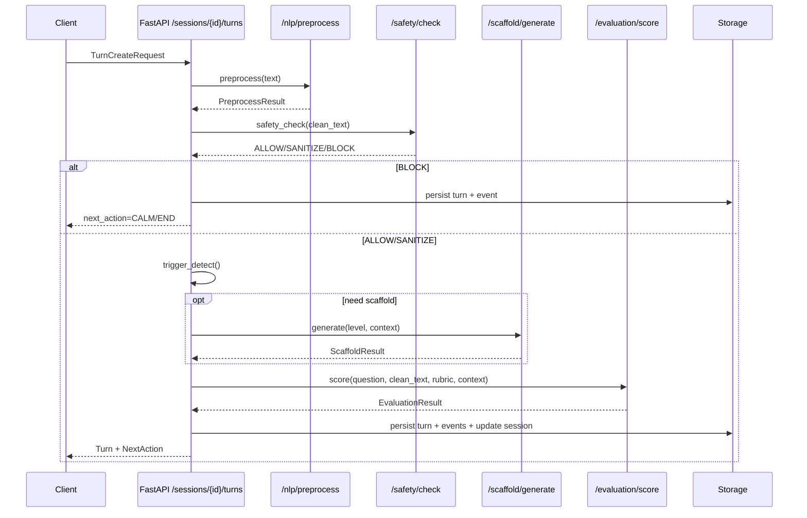

# 05 单回合处理流水线（Turn Processing Pipeline）

本节面向后端实现 `/sessions/{session_id}/turns` 的**工程级**细节：顺序、缓存、幂等、延迟预算、失败策略。

---

## 5.1 输入与幂等

### 5.1.1 TurnCreateRequest
- `input.type = text | audio_ref`
- `client_meta` 可带客户端时间戳与平台信息

### 5.1.2 幂等建议
为防止客户端重试导致重复 turns：
- 客户端：携带 `client_meta.client_timestamp`（精确到秒/毫秒）
- 服务端：生成 `idempotency_key = hash(session_id, client_timestamp, input.text/audio_id)`
- 若检测到相同 key，返回已存在的 turn（而不是重复评分）

---

## 5.2 处理顺序（强烈建议固定）

1) **Load Session**：校验 session 存在且未结束  
2) **Ingest Input**：生成 turn_id、turn_index  
3) **ASR（可选）**
   - 若 input 为 audio_ref：获取音频 → `/asr/transcribe`（内部调用）
   - 输出 AsrResult：raw_text + tokens(start_ms/end_ms) + silence_segments + audio_features  
4) **NLP Preprocess**
   - 输入：raw_text 或 input.text
   - 输出：clean_text + filler_stats + hesitation_rate  
5) **Safety Check**
   - `ALLOW`：继续  
   - `SANITIZE`：用 sanitized_text 替换 clean_text，并写 event  
   - `BLOCK`：直接 next_action=CALM 或 END（并写 event），跳过后续评分  
6) **Trigger Detection**
   - 规则优先：SILENCE/HELP/LOOP/OFFTRACK/STRESS  
   - 必要时用 LLM 分类辅助（低频）  
7) **Scaffold Decision**
   - 若需脚手架：选择 level(L1-L3) → `/scaffold/generate`  
8) **Evaluation Score**
   - 输入：题目、clean_text、rubric、上下文（最近 k turns）  
   - 输出：scores + evidence + votes + confidence + discounts  
9) **State Update**
   - 更新 θ（EMA/加权平均）  
   - 更新 session.state（见 02_state_machine.md）  
10) **NextAction Decision**
   - 选择 ASK/PROBE/SCAFFOLD/CALM/WAIT/END + text  
11) **Persist**
   - 写 turns 表（Turn 快照）
   - 写 events 表（细粒度）
   - 更新 sessions 表（state、theta、cursor）

---

## 5.3 延迟预算（交互体验）

建议目标（单回合同步返回）：
- NLP + safety + triggers：< 300ms
- scaffold.generate：< 800ms（必要时）
- evaluation.score：1.5–3s（多评委并行）
- 总计：2–4s（可接受的交互延迟）

优化手段：
- 评委并行 + 超时降级（见 07_scoring_engine.md）
- 缓存：相同输入的评分结果按 hash 缓存（短期）
- 异步：对报告生成、事件导出等非热路径异步化

---

## 5.4 失败策略（工程兜底）

### 5.4.1 LLM 超时/失败
- 评委少于最小数量 N_min（如 2）：
  - 使用规则评分的“保守 fallback”（只对 plan/evaluate 给低分并提示）
  - 或返回 next_action=WAIT，并提示系统暂时不可用（仅内部测试环境）
- 记录 event：`llm_timeout` / `llm_error`

### 5.4.2 ASR 失败
- 若音频不可用：要求客户端重传（next_action=ASK 重新描述/上传）
- 若转写低置信：触发 `SCAFFOLD L1`（要求候选人用文字概述思路）

### 5.4.3 Safety 命中
- category=PROMPT_INJECTION：action=BLOCK 或 SANITIZE
- 对候选人显示 **不带细节** 的提示（避免教会注入技巧）

---

## 5.5 时序图（核心接口）

